 　# Buildguide for cool642tb
 

## 0 部品の確認
 
Follow the BOM on github's readme.md to make sure that all the parts are available.
 
githubのreadme.mdのBOMに沿って、部品が全て揃っているかを確認してください。
 
There are three PCBs. Of the three pieces, two are left and right keyboard boards, and the remaining one is a trackball board.
 
PCBが３枚あります。表裏を確認してください。３枚のうち、2枚が左右のキーボード基板で、残り１枚がトラックボール基板です。
 

## 1 ダイオードのはんだ付け

If the diode is already soldered, please skip this operation.
 
すでにダイオードのはんだ付けされている場合は、この作業を省略してください。
 
 
This work is done on the left and right keyboard boards respectively.
 
この作業は左右のキーボード基板でそれぞれ行います。
  
Solder the diodes to the back of PCB.
 
PCBの裏面にダイオードのハンダ付けをします。
 
The diode is compatible with SMD and lead type.
 
ダイオードは、SMDとリードタイプに対応しています。
 
Diodes have polarity, so be careful about the direction in which they are installed.
 
ダイオードには極性がありますので、取り付ける向きに注意してください。
 

[ダイオード（SMD)のはんだ付けの動画](https://youtu.be/ODk16bd4XkA)
 
[ダイオード（リードタイプ）のはんだ付けの動画](https://youtu.be/lbAQkKzNawM)
 
[ダイオード（リードタイプ）のはんだ付けの動画２](https://youtu.be/3hWZjaBROL8)

 

## 2  スイッチソケットのハンダ付け

cool642tb supports choc and cherryMX switch sockets.
 
cool642tbでは、chocおよびcherryMXのスイッチソケットに対応しています。
  
As long as you solder only one side, you'll be fine.
 
どちらか一方だけ、はんだ付けをすれば、大丈夫です。
  
Solder the switch socket on the back of the left and right keyboard boards.
 
左右のキーボード基板の裏面にスイッチソケットのハンダ付けをします。
 

[Switch socketハンダ付け動画](https://youtu.be/ZnbgaueMR4w?si=_JLjD--3HJJ5Pu7Q)

 

## 3 Seeed xiao bleのハンダ付け

<b>Note</b>
PCB ver.1.21以降の場合、次の動画を参考にしてください。
 

[xiao bleのハンダ付け動画](https://youtu.be/98yqLjzfdl4)

PCB ver.1.2以前の方は、次の説明を参考にしてください。
 
画像は別のキーボードですが、手順は同じです。

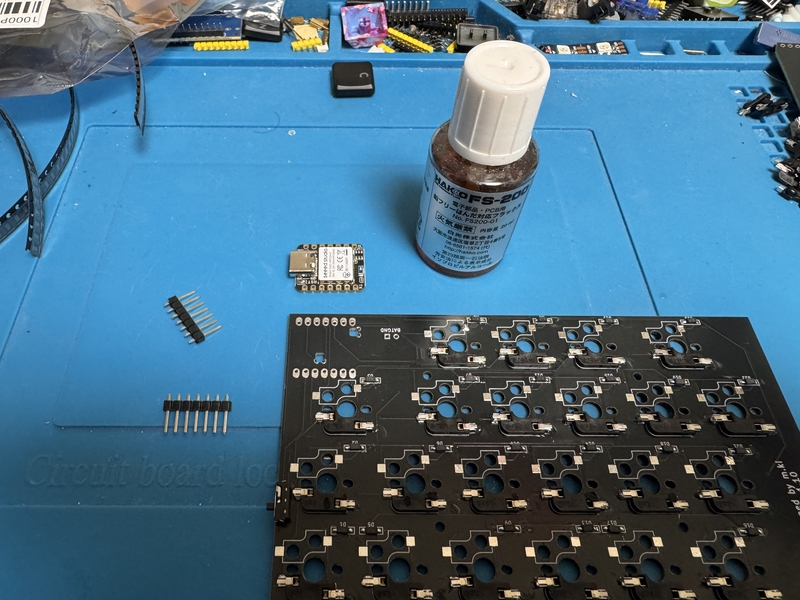

Solder Seeed xiao ble on the front of the left and right keyboard boards. The difficulty is high, so please do it carefully.
 
左右のキーボード基板の表面に、Seeed xiao bleをハンダ付けします。難度が高いので、注意深く行なってください。
 

Please follow the steps below.
 
次の手順に沿って行ってください。
 
1 The one with the xiao reset switch is the surface. Apply flux to the 4 BAT and NFC terminals on the back.
 
1 xiaoのリセットスイッチのある方を表面とする。裏面にある、BATとNFCの端子４つにフラックスを塗る。

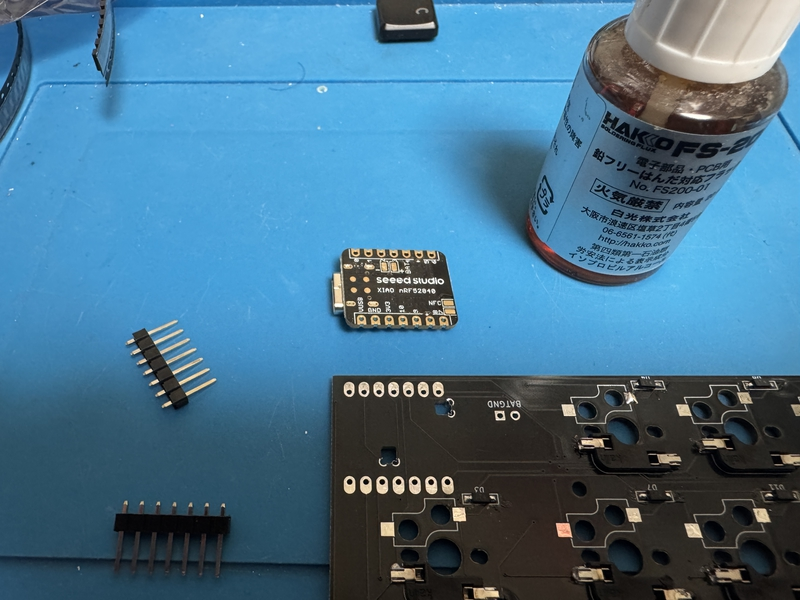

 
  
2 Put the front of the keyboard board up and put xiao on it. The one with the xiao reset switch is up.
 
2 キーボード基板の表面を上にして、xiaoを載せる。xiaoのリセットスイッチのある方を上にする。
 
 
3 Use the pin header included with xiao, insert it into the left and right pin holes, and temporarily fix it.
 
3 xiao付属のピンヘッダを利用し、左右のピン穴に差し込み、仮固定する。

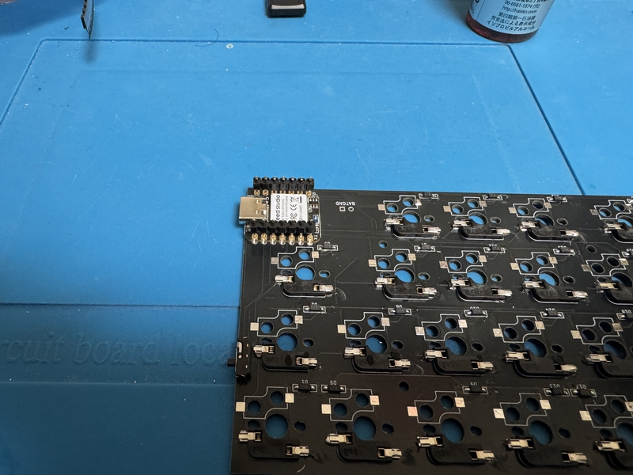
 
 
4 Change the orientation of the board and xiao. The back side of the keyboard board is facing up.
 
4 基板とxiaoの向きを変える。キーボード基板の裏面が上になる。

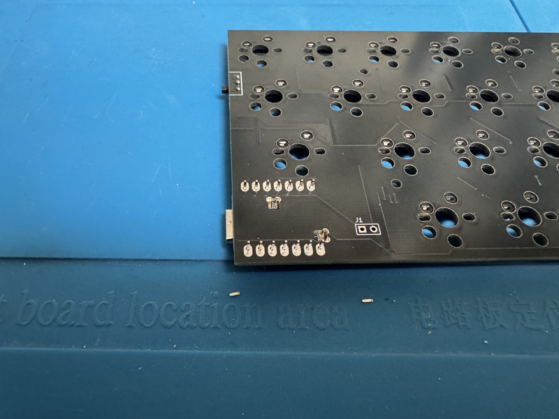

 
 
5 Make sure that there are two rectangular open places on the board where xiao overlaps. Apply flux to the terminal of that part.
 
5 基板には、xiaoが重なっているところに、四角形に開いた箇所が2箇所あることを確認する。その部分の端子にフラックスを塗る。
 
 
6 Apply the warmed solder to 5 places (there are 4 places, one at a time). At the time when it is warm enough to produce a little smoke, attach the solder wire to the solder and pour in the solder.
 
From the open part of the square, if the solder is placed on the terminal of the xiao and sticks to the terminal of the board, it is fine.
  
If you put in too much solder, use the solder suction to remove excess solder.
 
6 温めたハンダゴテを５の場所（4箇所あるので、１つずつ）に当てる。少し煙が出るほど温めたタイミングで、ハンダ線をハンダゴテに付けて、ハンダを流し込む。

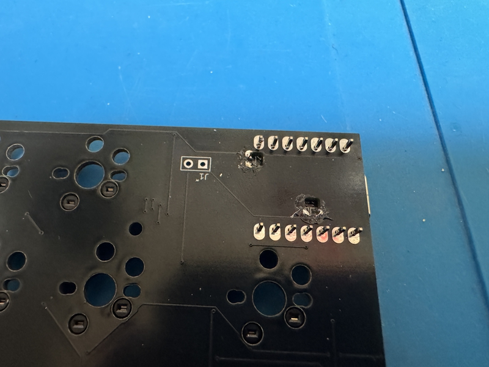

 
　四角形の開いた部分から、xiaoの端子にハンダが載っていて、基板の端子とくっついていれば、大丈夫である。
 
　ハンダを多く入れ過ぎた時は、ハンダ吸い取り を使い、余分なハンダを除去する。
 
 
7 With the back of the keyboard board up, pull out the temporarily fixed pin header from the board and xiao.
 
7 キーボード基板の裏面を上にして、仮固定のピンヘッダを基板とxiaoから抜く。

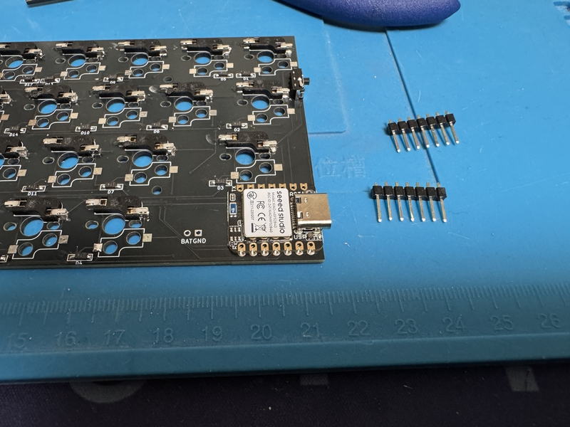

 
 
8 Apply flux to the left and right outer terminals of xiao. After that, solder each terminal.
 
8 xiaoの左右外側にある端子にフラックスを塗る。その後、端子ごとに、ハンダ付けをする。
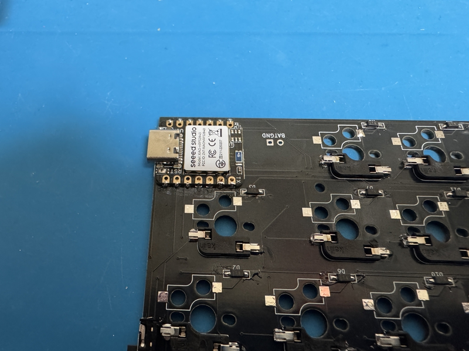
 
 
Did you do well?
 
上手くできましたか？
 
 
For safety, use a tester to check whether there is continuity at the following two points. If there is continuity, suck up the excess solder.
 
安全のため、テスターを使い、次の２箇所が導通していないかどうか調べてください。導通していたら、余分なはんだを吸い取ってください。
 

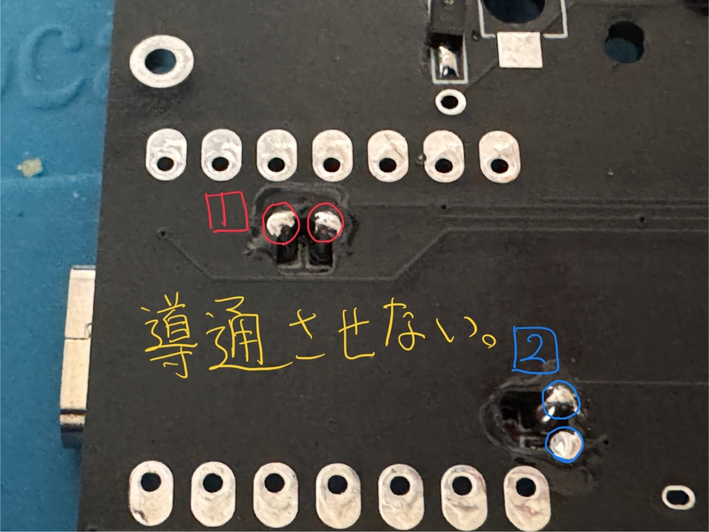

## 4a  電池ボックス取り付け（cool642tb）

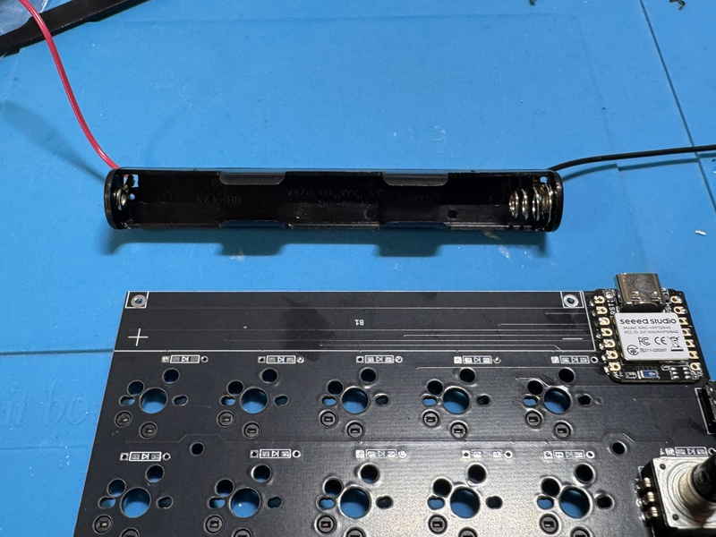

Cut the red and black cables of the battery box about 1cm from the base. Peel off the film from the remaining 1cm.
 
電池ボックスの赤色、黒色のケーブルは根元から１cmぐらいのところで、切断します。１cm残した部分は、皮膜を剥がしてください。
 
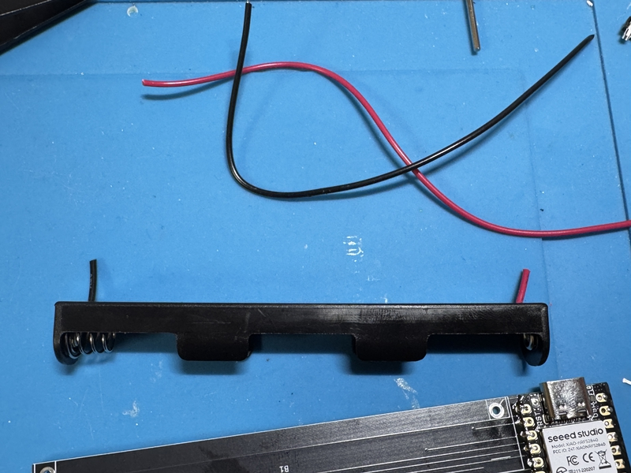

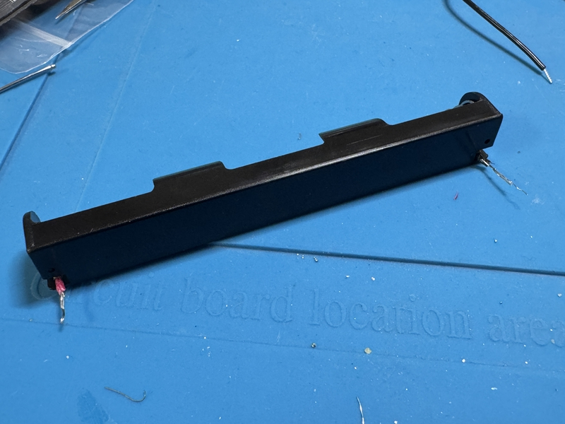
 
Apply double-sided tape to the back of the battery case. Use double-sided tape to secure the battery case and PCB.
 
電池ケースの裏面に両面テープを貼ります。電池ケースとPCBは両面テープを使って、固定します。
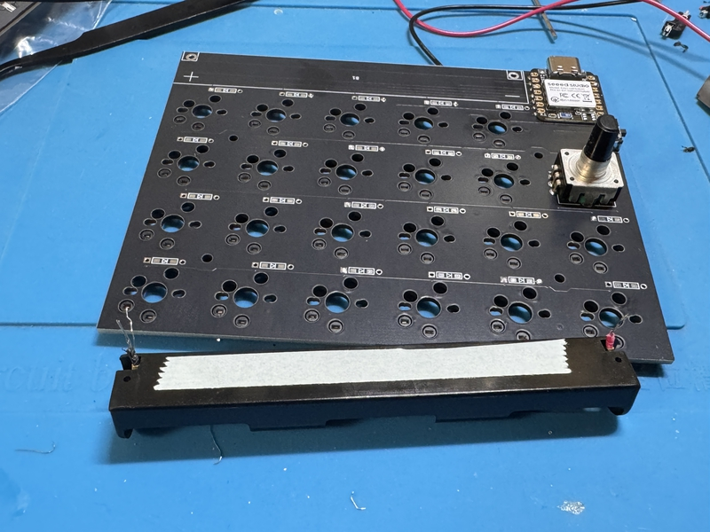

Pass the battery case cable through the hole in the PCB and secure it.
 
電池ケースのケーブルをPCBの穴に通すように固定してください。
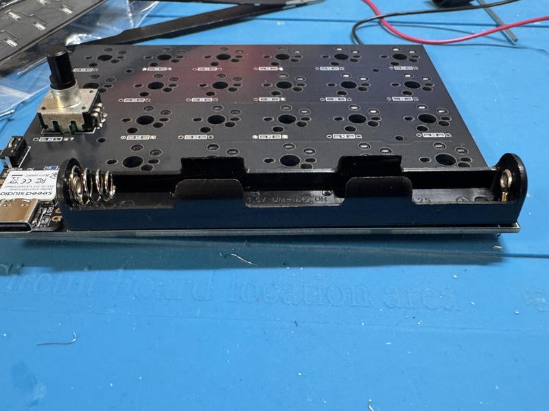

Turn the back of the PCB face up. Carefully fold the cable extending from the battery case in two places and solder it.
 
PCBの裏面を上に向けます。電池ケースから延びたケーブルを２箇所、上手に折りたたんで、はんだ付けをします。
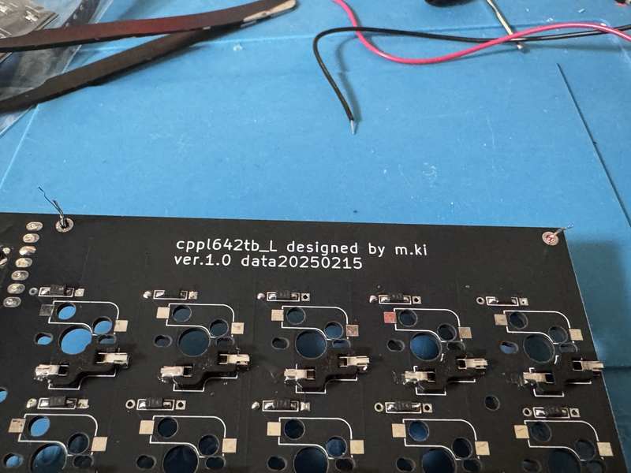
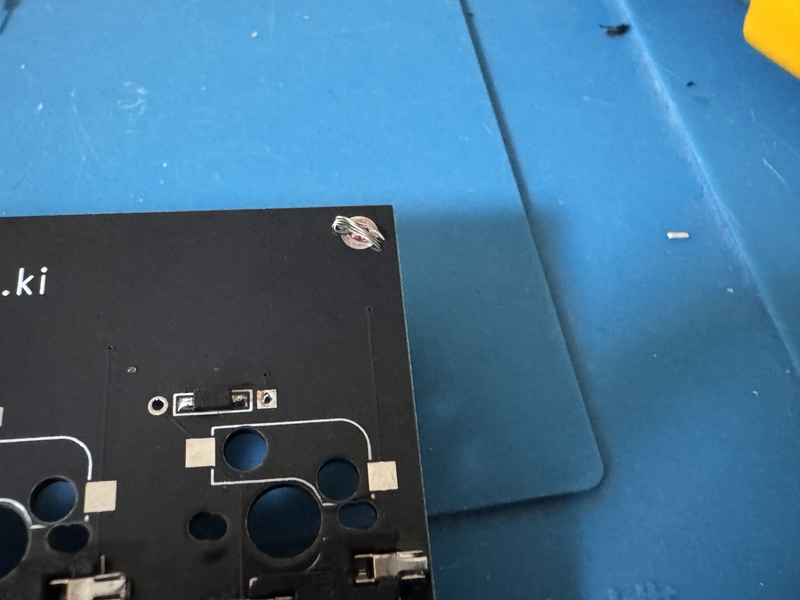
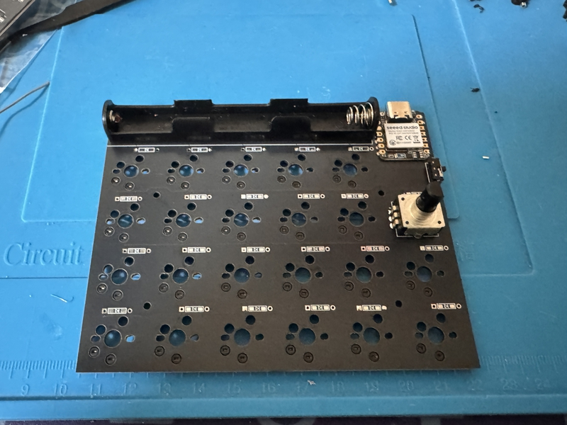
 

## 4b 電池ボックスの取り付け（cool642tb_r2）

Insert the battery box from the top of the board and temporarily secure it with masking tape. Then, cut off any leads sticking out from the top of the board with pliers or something similar and solder them in place. Attach the four pieces, matching the left and right sides. Also, be careful of the orientation.
 
電池ボックスを基板の上面から、差し込み、マスキングテープで仮固定します。そして、基板の上面から飛び出したリードをニッパーなどで切り取り、ハンダ付けをしてください。左右で合わせて、４つ取り付けます。また、向きに注意してください。
 

## 5a スライドスイッチのハンダ付け（cool642tb）

Insert the switch from the front of the PCB with the switch knob facing outward.
 
スイッチのつまみが外側に向くようにして、PCBの表面から差し込みます。

After temporarily fixing it with masking tape, etc., solder the exposed part of the PCB.
 
マスキングテープなどで仮固定をしてから、PCBの裏面に出た部分をはんだ付けします。
 

[スライドスイッチのはんだ付けの作業動画](https://youtu.be/5nkRklibay4)

 

## 5b スライドスイッチのハンダ付け（cool642tb_r2）

Insert the switch from the underside of the PCB with the tab facing outwards.
 
スイッチのつまみが外側に向くようにして、PCBの下面から差し込みます。

Temporarily fix it with masking tape or something similar, then solder the part that is exposed on the top surface of the PCB.
 
マスキングテープなどで仮固定をしてから、PCBの上面に出た部分をはんだ付けします。
 

[スライドスイッチのはんだ付けの作業動画](https://youtu.be/5nkRklibay4)

## 5.5　リセットスイッチのハンダ付け

  
PCB ver.1.21以降、リセットスイッチが付きました。
 
 

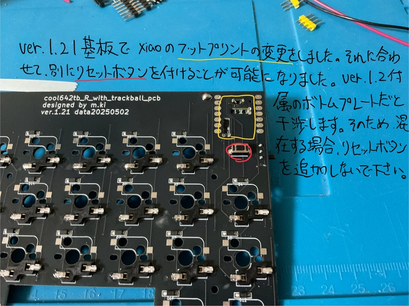

Insert the reset switch from the bottom of the board.
 
基板の下面からリセットスイッチを挿入します。
 
Cut off any leads sticking out from the board using pliers or similar.
 
基板からはみ出たリードをニッパーなどで切り取ります。
 
Then, solder it.
 
その後、ハンダ付けをしてください。
 

[リセットスイッチハンダ付け動画](https://youtu.be/Pl24Exfh8b8)

## 6 L字コンスルー（またはピンヘッダ） のハンダ付け

First, use a nipper or cutter to cut the L-shaped conslue into 7 pins.
 
If you suddenly try to cut between the 7th and 8th pins, it is easy to fail, so it is a good idea to cut between the 8th and 9th pins and then adjust them with a file.
 
最初にL字コンスルーを7ピンになるようにニッパーやカッターなどを使い、裁断してください。
 
いきなり、７つ目のピンと８つ目のピンの間を裁断しようとすると、失敗しやすいので、8つ目と９つ目の間を裁断してからヤスリなどで調整するとよいでしょう。
 
 
Insert the L-shaped through spring from the surface of the keyboard board and temporarily fix it with masking tape, etc.
 
Turn the back of the board up and solder it.
 
L字コンスルーのバネのついていない方を、キーボード基板表面から差し込んで、マスキングテープなどで仮固定します。
 
基板裏面を上向にして、ハンダ付けをします。
 
 

## 7 トラックボール基板の作成

Caution PMW3610 is prone to sensor damage when exposed to high temperature heat. Please complete the soldering of each pin in a short time.
 
注意　PMW3610は高温の熱にさらされるとセンサーの破損が発生しやすいです。それぞれのピンのはんだ付けは短時間で済ませてください。
 
As for my example, soldering is processed in 2-3 seconds per pin.
 
私の例ですが、はんだ付けを１つのピンにつき、2〜3秒で処理します。
 
 
Note: The silk of "Front side" and "Back side" on the board is written for the ball.
 
注意　基板に「Front side」や「Back side」のシルクは、ボールに対しての表記です。
 
 
The trackball board has components installed from the beginning. The implemented side is the back side.
 
トラックボール基板は最初から部品が実装されています。実装されている面を裏面とします。
 
 
Remove the PWM3610 acrylic parts.
 
PWM3610アクリル部品を取り外します。
 
 
Check the pin of the PMW3610 and insert it from the surface of the trackball board. Temporarily fix it with masking tape.
 
PMW3610のピンを確認して、トラックボール基板の表面から差し込みます。マスキングテープで仮固定します。

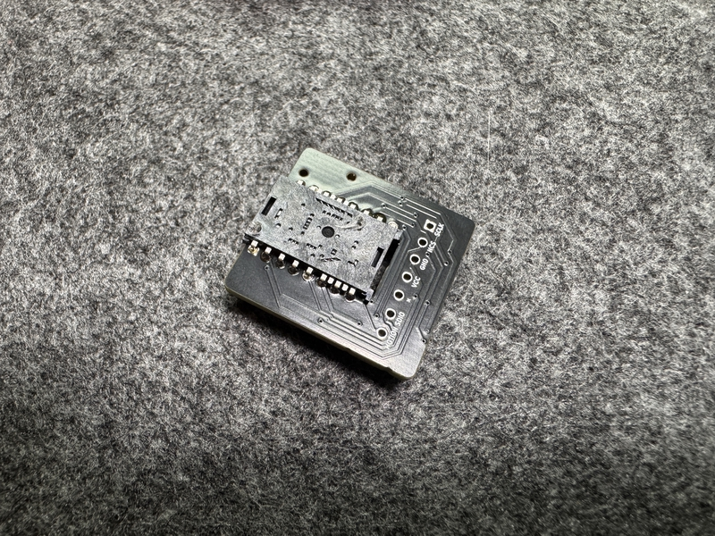

 
 
The back of the trackball board is facing up and the part that came out of the pin hole is soldered.
 
トラックボール基板の裏面を上向きにして、ピン穴からでた部分をはんだ付けします。
 
 
The lens part of the PMW3610 is covered with tape, so remove it.
 
PMW3610のレンズ部分がテープで覆われているので、それを外します。
 
 
From the back of the trackball board, cover the acrylic part on the PMW3610, and melt the acrylic on the back with a soldering ick to prevent it from coming off.
 
トラックボール基板の裏面の方から、アクリル部品をPMW3610に被せて、その裏側に出たアクリルをハンダごてで溶かして外れないようにします。

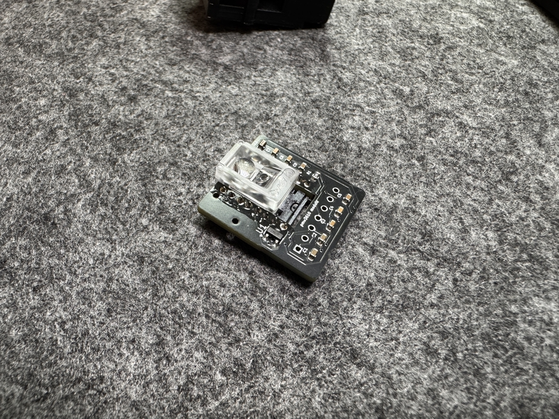
 
 

## 8 ロータリーエンコーダのはんだ付け

Insert the rotary encoder from the front side of the PCB and solder it on the back side of the PCB.
 
PCB表面から、ロータリーエンコーダーを差し込み、PCB裏面ではんだ付けをします。

  
The rotary encoder has three claws on one side, one claw on both sides, and two claws on the other side.
 
ロータリーエンコーダーには1辺に３つの爪があり、その両脇の辺に１つの爪があり、残り１辺に２つの爪があります。
 
Of these, 3 nails and 2 nails are the parts related to the input, so we will solder them.
 
このうち、３つの爪と２つの爪は入力に関わる部分ですので、はんだ付けをします。
 
For one nail, there is no problem without soldering.
 
１つの爪については、はんだ付けしなくても問題ありません。
  

## 9a スイッチプレートの組み立て(choc)

Stack the switch plate and PCB in this order from the top, and insert four M2 5mm screws from the top.
 
Fix the four points from the bottom of the PCB with M3 3mm spacers.
 
上からスイッチプレート、PCBの順番で重ねて、上からM2 5mmネジを４本差し込みます。
 
PCBの下からM3 3mmスペーサーで４箇所を固定します。
 
 
There are 4 places each on the left and right, a total of 8 places.
 
左右それぞれ4箇所で、合計8箇所行います。
 

## 9b スイッチプレートの組み立て(cherryMX)

Insert the M2 8mm screw from the top of the switch plate.
 
Fix it with an M2 3mm spacer on the bottom of the switch plate.
 
スイッチプレート上面からM2 8mmネジを差し込みます。
 
それをスイッチプレート下面でM2 3mmスペーサーで固定します。
 
 
Overlay the switch plate on the PCB.
 
There are some M2 8mm screws on the underside of the PCB, so fix them with an M2 3mm spacer.
 
There are 4 places each on the left and right, a total of 8 places.
 
スイッチプレートをPCBに重ねます。
 
PCB下面にM2 8mmネジが少し出ますので、M2 3mmスペーサーで固定します。
 
左右それぞれ4箇所で、合計8箇所行います。

## 10 スイッチの差し込み

Plug your favorite key switch into the one you made in section 8.
 
When plugging in, it may not be plugged in properly and the terminal of the key switch may bend.
 
Please be careful.
 
If it is bent, it can be repaired with radio pliers, etc., and it can be reused.
 
It's a mistake you often make, so don't worry about it, plug in the key switch more and more.

 
セクション8で作ったものに、自分のお気に入りのキースイッチを差し込みます。
 
差し込むときに、うまく差し込めず、キースイッチの端子が曲がってしまうことがあります。
 
気を付けてください。
 
もし曲がったときは、ラジオペンチなどで直しせば、再利用できます。
 
自分もよくやるミスなので、気にせず、どんどんキースイッチを差し込みましょう。
 
 

## 11 ボトムプレートの取り付け

Insert four M2 3mm screws from the bottom of the bottom plate to secure it. The left and right bottom plates have different shapes, so please align them with the switch plate.
 
ボトムプレートの下面からM2 3mmネジを４箇所差し込んで、固定してください。ボトムプレートは左右の形が違いますので、スイッチプレートと向きを合わせてください。
 
 
The side with the recess to hide the screw heads will be the bottom of the bottom plate.
 
ネジの頭を隠すための窪みがある方がボトムプレートの下面になります。
 
 

## 12 トラックボールケースの固定

Install the trackball board to fit the 7 pins of the L-shaped through on the right side of the keyboard board.
 
Insert 2 M2 4mm screws from the inside of the ball case and fix it with an M2 3mm spacer on the bottom of the ball case.
 
Insert the ball case so that it can be put on the trackball board.
 
The spacer on the bottom of the ball case is inserted into the concave part of the bottom case.
 
Insert 2 M2 4mm screws from the bottom of the bottom case and fix the spacer.
 
トラックボール基板をキーボード基板の右手側にあるL字コンスルーの7ピンに合うように取り付けます。
 
ボールケースの内側から2箇所、M2 4mmネジを差し込み、ボールケース底面でM2 3mmスペーサーで固定します。
 
ボールケースをトラックボール基板に被せるように差し込みます。
 
ボールケース底面にあるスペーサーがボトムケースの凹部に差し込まれるようにします。
 
ボトムケース底面から2箇所、M2 4mmネジを差し込み、スペーサーを固定します。
  
 
If you want to turn the ball better, put the support ball in 3 places in the ball case. Woodworking bonds are the best for fixing.
 
よりよくボールを回したいと考えているならば、支持球をボールケース内に3箇所入れてください。固定には、木工用ボンドが最適です。
 
 
Please attach a 25mm ball to the ball case.
 
ボールケースに25mm球を装着してください。
 
 

## 13 キーキャップの装着

Please attach your favorite keycap (All 1U size).
 
お好きなキーキャップ（全て1Uサイズ）を装着してください。
 

## 14 完成

After attaching non-slip rubber to the bottom of the bottom case, it's done.
 
Please enjoy a life with a better keyboard.
 
ボトムケースの底面に、滑り止めゴムを取り付けたら、完成です。
 
よりよいキーボードのある生活を楽しんでください。
 

## 15 動作確認について

ファームウェアの導入について、こちらの記事を参考にしてください。
 
[自作キーボードへのzmk_firmwareのインストールについて](https://sizu.me/m_ki/posts/kvixkn2mec6a)

 
Keymapの編集について、こちらの記事を参考にしてください。

[zmk_firmwareでのキーマップ編集について](https://sizu.me/m_ki/posts/m3devs7be5km)

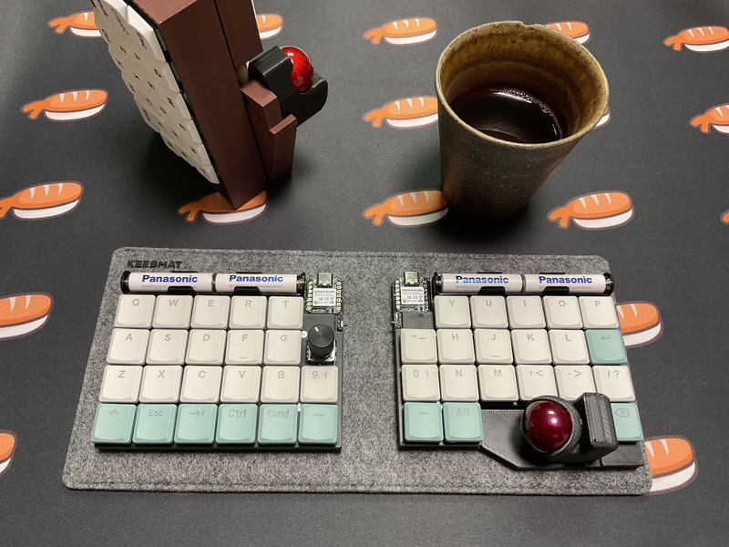

